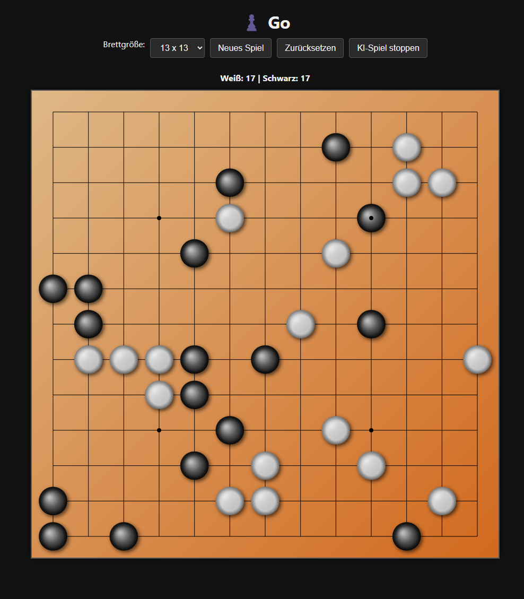

# Go Board in the Browser

## Overview

This project is a browser-based implementation of the board game **Go (Weiqi/Baduk)** written in **TypeScript** using **HTML5 Canvas** for rendering. The application includes basic Go gameplay, a simple AI opponent, and interactive features to support various board sizes and game modes.

## Features

- Playable Go board with 9x9, 13x13, or 19x19 sizes  
- Manual play and AI opponent (Minimax-based)  
- AI vs. AI simulation mode  
- Capture detection including sound effects when stones are removed  
- Ko rule and suicide prevention implemented  
- Score counting based on territory and captured stones  
- Responsive and dark mode–friendly user interface  
- Visually enhanced board and stones with lighting effects  

## Technologies Used

- TypeScript  
- HTML5 Canvas  
- JavaScript Modules (ES6)  
- CSS (inline styling in HTML)  

## Getting Started

1. Clone or download this repository.  
2. Place all files in the same directory (including audio files).  
3. Open `index.html` in any modern browser (Chrome, Firefox, Edge).  
4. Select a board size and start a game using the buttons.  

## Customization

- **Sounds**: You can replace `click.wav` and `capture.wav` with your own sound files.  
- **Styling**: The dark mode and layout can be adjusted in the `<style>` section of `index.html`.  
- **AI Depth**: The difficulty of the AI can be changed by modifying the Minimax depth in `Board.ts`.  

## Known Limitations

- This is a simplified implementation and does not handle full Japanese or Chinese scoring rules.  
- The AI is basic and may not always play strong moves.  
- No support for pass or game-end negotiation (yet).  

## License

This project is provided for educational and personal use. Feel free to adapt or extend it as needed.
